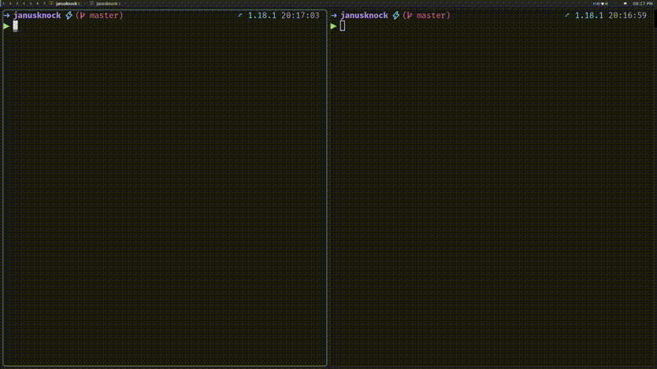
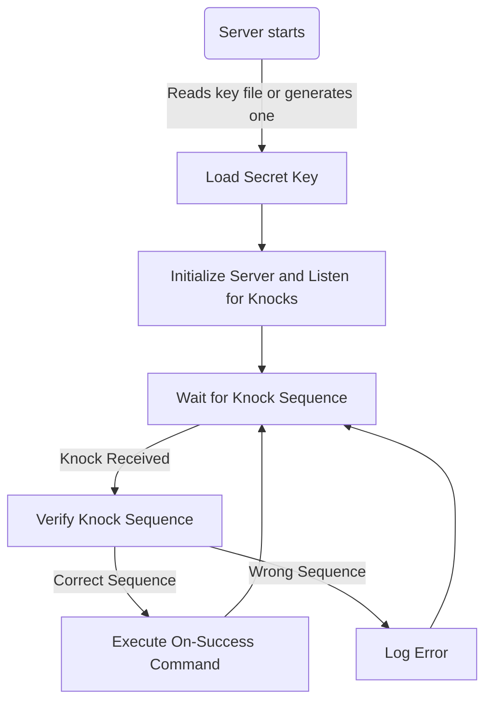

# JanusKnock

Customizable port knocking tool that requires sending a specific sequence of knocks on predefined ports in the correct order. Ports change every 30 seconds, generated using a secret key created by the server, which must be shared with the client. Upon a successful sequence, user-defined bash scripts can be executed.



## Features

- **Port Knocking**: Secures access by requiring a specific sequence of knocks on predefined ports.
- **Custom Commands**: Executes user-specified bash scripts or commands upon successful port knocking.
- **Secure**: The security is derived from a secret key generated by the server, which is used to produce the port sequence based on the current timestamp. Ports change every 30 seconds, and the client must have the secret key to determine the correct ports.
- **Flexible Modes**:
  - `server`: Listens for port knocking sequences and executes the success command.
  - `client`: Sends port knocks to a specified host.

Aquí está tu sección de instalación actualizada en el README con el método que he creado:

### Server behaviour



---

## Installation

You can install JanusKnock easily using the provided installation script. This will automatically detect your platform, download the appropriate binary, and install it in `/usr/local/bin`.

### Quick Install with Curl

Run the following command:

```bash
curl -L https://raw.githubusercontent.com/estevesegura/JanusKnock/main/install.sh | bash
```

### Quick Install with Wget

Alternatively, you can use `wget`:

```bash
wget -qO- https://raw.githubusercontent.com/estevesegura/JanusKnock/main/install.sh | bash
```

## Usage

### Quick Start

Let's see a practical example of securing SSH access:

#### Server Setup

1. Create a bash script to open port 22 (save as `open_ssh.sh`):
```bash
#!/bin/bash
iptables -A INPUT -p tcp --dport 22 -j ACCEPT
```

2. Make the script executable:
```bash
chmod +x open_ssh.sh
```

3. Start JanusKnock server (add this to your system's boot sequence):
```bash
janusknock --mode server --file /path/to/.key --on-success "./open_ssh.sh"
```
If the key file doesn't exist, the server will automatically generate one.

#### Client Setup

1. Copy the key from the server to your client machine. The `-n` flag is crucial as it prevents adding a newline character that would invalidate the key:
```bash
echo -n "YOUR_SERVER_KEY" > .key
```

2. Execute the knock sequence:
```bash
janusknock --mode client --file .key --host SERVER_IP
```

If the key matches, the server will execute the bash script, opening port 22 for SSH access. You can now proceed with your SSH connection:
```bash
ssh user@SERVER_IP
```

This example demonstrates basic SSH protection, but remember - you can trigger any bash script on successful knock sequence, making JanusKnock highly versatile for various security scenarios.

## Basic Usage

### Server Mode

The server listens for a port knocking sequence and executes a user-defined command upon success.

```bash
janusknock --mode server --file /path/to/keyfile --on-success "/path/to/success_script.sh"
```

- `--file`: Path to the key file used to generate the port sequence.
- `--on-success`: Path to the bash script or command to execute when the sequence is correct.

If no `--file` is provided, a `.key` file is generated automatically.

### Client Mode

The client sends the port knocking sequence to the target server.

```bash
janusknock --mode client --file /path/to/keyfile --host <server_ip>
```

- `--file`: Path to the key file containing the secret for generating the port sequence.
- `--host`: IP address or hostname of the server.

## License

This project is licensed under the MIT License. See the [LICENSE](LICENSE) file for details.
